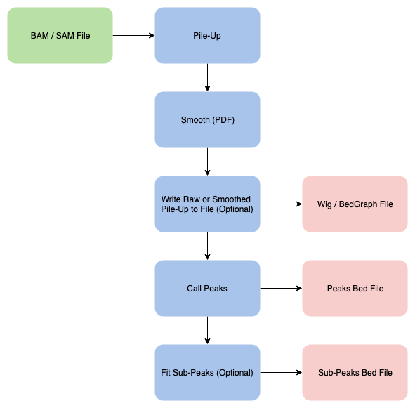

# ZPeaks

A Dockerized application for finding peaks from alignment files.

## Steps



## Requirements

- Memory: ZPeaks stores all pile-up data for all chromosomes given in dense arrays, in memory, at once. As a rule 
of thumb, you should use at least 5x the number of base pairs in the genome + 1GB. For human, this means 16GB.
- CPUs: ZPeaks can parallelize for compute intensive tasks at a sub-chromosome level. It will run efficiently with 
any number of cores.

## Running

The built docker container can be found on docker hub as genomealmanac/zpeaks.

To run make sure the files you pass are accessible within the container and run the container with the command 
followed by the arguments you need:

`java -jar /app/zpeaks.jar`

### Arguments

| Name |  Description | Default |
|---|---|---|
| ```-samIn```| Input Sam or Bam alignment file. | |
| ```-signalOut```| Output Signal File. Enables signal output. | |
| ```-signalOutType```| Output "raw" and "smoothed" Pile-Up data to the signal file. | smoothed |
| ```-signalOutFormat```| Output Signal File to "wig" or "bed-graph" file | bed-graph |
| ```-peaksOut```| Output peaks bed file. | |
| ```-subPeaksOut```| Output sub-peaks bed file. | |
| ```-strand```| Strand to count during pile-up. "plus", "minus", or "both" | both |
| ```-signalResolution```| Number of decimal places to keep in outputted signal values. | 1 |
| ```-forwardShift```| During pile-up, shift the forward strand by this amount. Can be positive or negative. | 0 |
| ```-reverseShift```| During pile-up, shift the reverse strand by this amount. Can be positive or negative. | 0 |
| ```-pileUpAlgorithm```| Algorithm used to select values during pile-up. "start", "midpoint", or "length" | start |
| ```-smoothingFactor``` | Smoothing factor for calculating PDF for pile-up data during peaks step. | 50.0 |
| ```-normalizePdf```| If true, PDF values are scaled to the natural gaussian amplitude. | |
| ```-threshold```| Threshold used during peak calling. | 6.0 |
| ```-fitMode```| Sub-peak fitting modes. "skew" or "standard" | skew |
| ```-parallelism```| Number of threads to use for parallel operations. | Number of cores on machine |
| ```-h`, `--help```| Show help message and exit. | |

The sam input file and at least one output file are required. Here's how a complete command with arguments should look:

`java -jar /app/zpeaks.jar -samIn=/data/in/my_exp.bam -subPeaksOut=/data/out/my_exp.bed`

## For Contributors

The scripts/ directory contains utilities you can use to build, test, and deploy

### Building

To build the docker container with a tag, use `scripts/build-image.sh`.
To build the Jar locally, use `scripts/build-local.sh`
To run the built Jar, use `scripts/run-local.sh`

### Testing

To run automated tests from command line, use `scripts/test.sh`
To run plots or performance tests, either run from IDE or comment out @Disabled on the tests and run individual tests 
manually with something like `./gradlew test --tests Plot."Plot Skew Sub-Peaks"`

### Deploying

To deploy the image to our docker repository, use `scripts/push-image.sh`