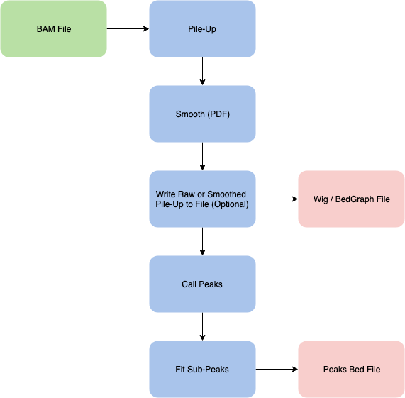
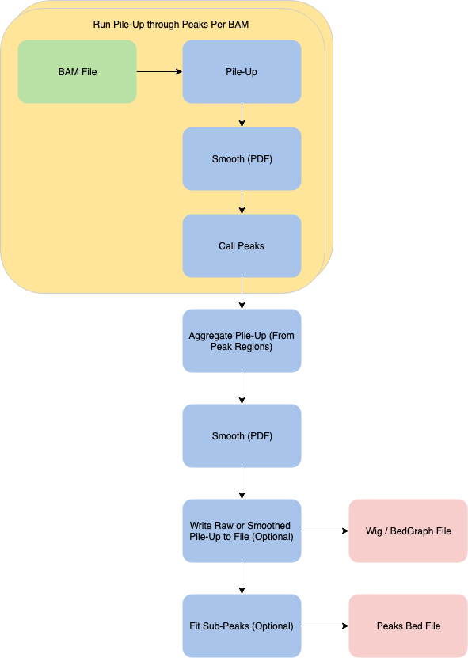
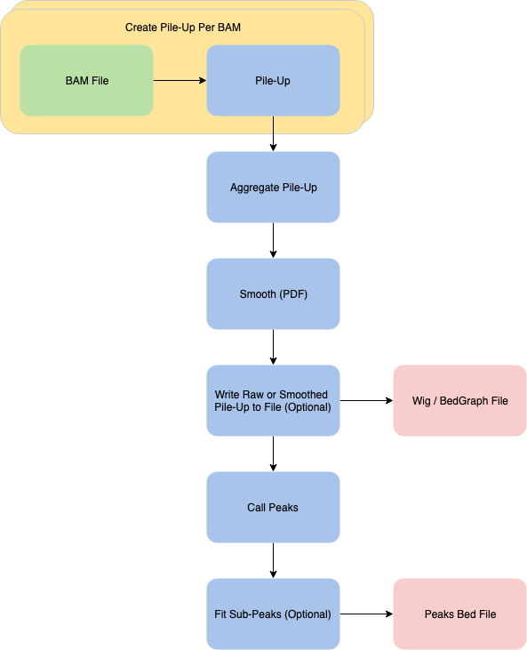

# ZPeaks

A Dockerized application for finding peaks from alignment files.

## Modes

ZPeaks can run in three modes: Single File, Top Down, and Bottom Up.

### Single File

Single File mode is for calculating peaks for a single BAM input file. 



### Top Down

Top Down mode is for calculating peaks on multiple BAM input files. This mode will call peaks for individual files, 
aggregate only the pile-up data from those peak regions, then smooth and fit sub-peaks on the aggregate data.

It will tend to give you more regions and will not miss those only present in only few files.



### Bottom Up

Bottom Up mode is for calcaulting peaks on multiple BAM input files. This mode will create a scaled pile-up from 
many files, then smooth and fit sub-peaks on the aggregate pile-up.

It will tend to give you fewer regions that are more pronounced / in more files. 



## Requirements

- Memory: 
    - Single File: LCS * 16B + 1GB (typically 5GB for human)
    - Bottom Up: LCS * 16B + 1GB (typically 5GB for human)
    - Top Down: LCS * 28B + 1GB (typically 8GB for human)
- CPUs: ZPeaks can parallelize for compute intensive tasks at a sub-chromosome level. It will run efficiently with 
any number of cores.

*LCS = The largest chromosome size (in base pairs) in your file(s). For human, it's Chr1 with 250,000,000.

## Running

The built docker container can be found on docker hub as genomealmanac/zpeaks.

To run make sure the files you pass are accessible within the container and run the container with the command 
followed by the arguments you need:

`java -jar /app/zpeaks.jar`

### Arguments

| Name |  Description | Default |
|---|---|---|
| `-runType` | Run type if multiple files are given. "top-down" or "bottom-up" | bottom-up |
| `-bamIn`| Input Sam or Bam alignment file. | |
| `-chrFilter` | Chromosome Filter File. See Below. | |
| `-signalOut`| Output Signal File. Enables signal output. | |
| `-signalOutType`| Output "raw" and "smoothed" Pile-Up data to the signal file. | smoothed |
| `-signalOutFormat`| Output Signal File to "wig" or "bed-graph" file | bed-graph |
| `-peaksOut`| Output peaks bed file. | |
| `-strand`| Strand to count during pile-up. "plus", "minus", or "both" | both |
| `-signalResolution`| Number of decimal places to keep in outputted signal values. | 1 |
| `-forwardShift`| During pile-up, shift the forward strand by this amount. Can be positive or negative. | 0 |
| `-reverseShift`| During pile-up, shift the reverse strand by this amount. Can be positive or negative. | 0 |
| `-pileUpAlgorithm`| Algorithm used to select values during pile-up. "start", "midpoint", or "length" | start |
| `-smoothingFactor` | Smoothing factor for calculating PDF for pile-up data during peaks step. | 50.0 |
| `-threshold`| Threshold used during peak calling. | 6.0 |
| `-fitMode`| Sub-peak fitting modes. "skew" or "standard" | skew |
| `-parallelism`| Number of threads to use for parallel operations. | Number of cores on machine |
| `-h`, `--help`| Show help message and exit. | |

The sam input file and at least one output file are required. Here's how a complete command with arguments should look:

`java -jar /app/zpeaks.jar -samIn=/data/in/my_exp.bam -subPeaksOut=/data/out/my_exp.bed`

### Chromosome Filter Files

Chromosome filter files allow you to only find peaks for a given set of chromosomes. You may optionally provide a range 
within the chromosome if you only want peaks within a region of a chromosome. 

For example, the following will calculate peaks for chromosome 1, 10-15 million on chromosome 2, and 
0-3 million on chromosome 3:

```
chr1
chr2    10000000-15000000
chr3    0-3000000
```

## For Contributors

The scripts/ directory contains utilities you can use to build, test, and deploy

### Building

To build the docker container with a tag, use `scripts/build-image.sh`.
To build the Jar locally, use `scripts/build-local.sh`
To run the built Jar, use `scripts/run-local.sh`

### Testing

To run automated tests from command line, use `scripts/test.sh`
To run plots or performance tests, either run from IDE or comment out @Disabled on the tests and run individual tests 
manually with something like `./gradlew test --tests Plot."Plot Skew Sub-Peaks"`

### Deploying

To deploy the image to our docker repository, use `scripts/push-image.sh`